# Google の予測値を用いた，感染拡大に伴う重症者患者の医療シェアリングシミュレーション (更新日：2021-02-10)

** 2021年2月10日現在，日本全国のコロナ感染者数は減少傾向です．そのため，2021年2月10日を持ちまして，更新を終了させていただきます．**

現在， 新型コロナウィルスの感染拡大が続いています．
Google の 28 日間予測では， 以下のように拡大すると考えられています．

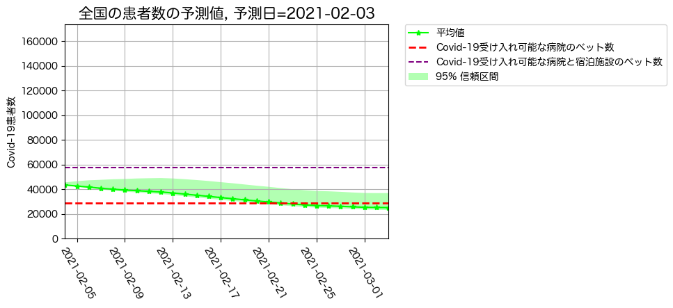

また， 厚労省が発表している重症者数と患者数の比率を用いると，重症者数が以下のように増加すると予想されます．

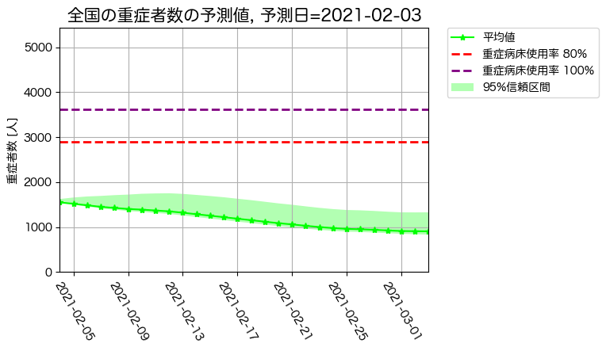

全体では， 重症者ベッド数は足りますが，いくつかの県では重症者病床数が不足すると試算されます．

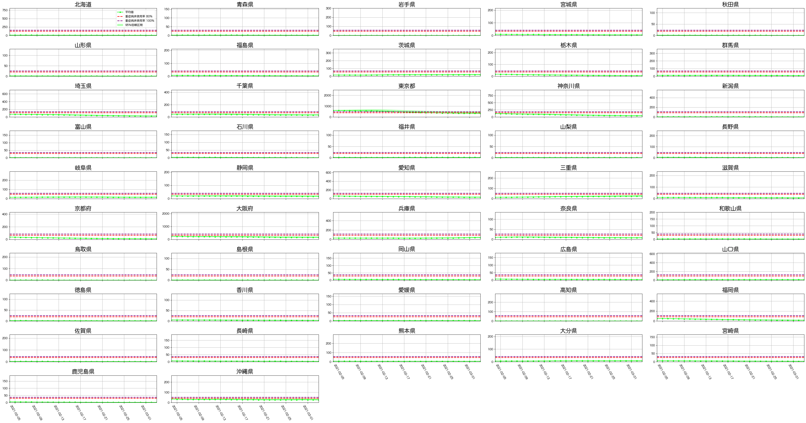

そのため，適切に重症患者を都道府県間で

この研究では， Google の感染者拡大モデルを用いて， 以下を行います．

1. 各県の 28 日先までの重症者数とその 95%信頼区間の推定
2. 推定された重症者数を用いて，必要な県間での適切な重症者の割当先とその人数の推定

その結果，搬送によって，以下のように緩和されます．

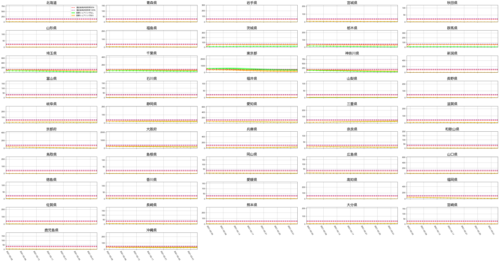

また， 主要な県で必要な医療シェリング数とその重症者患者のシェアリング先は以下のようになります．

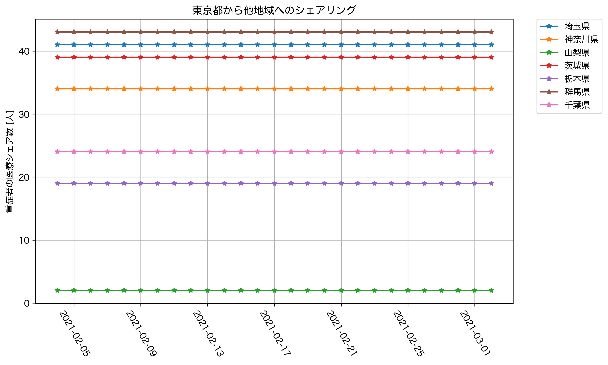

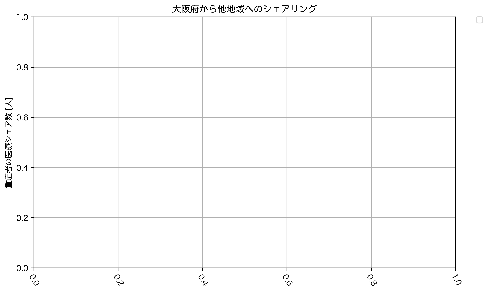

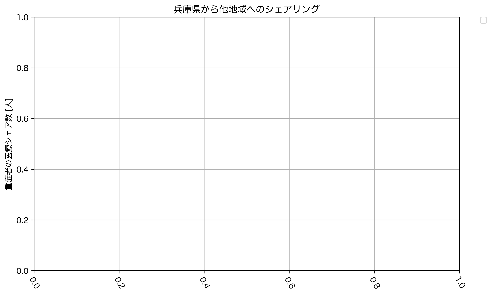

## 入院患者に関する結果

重症者数と同様に，病院の入院者数も同様に解析します．

厚労省が発表している入院者数と患者数の比率から，入院者数は以下のように増加すると予想されます．

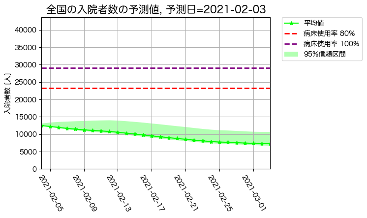

重症者数と同様に，全国では病床数は足りますが， 各県ではコロナ対策病床が不足すると試算されます．

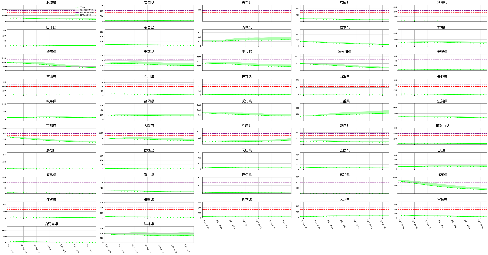

この研究では， Google の感染者拡大モデルを用いて， 以下を行います．

1. 各県の 28 日先までの入院者数とその 95%信頼区間の推定
2. 推定された入院者数を用いた， 必要な県間の医療シェアリング数の推定

医療者リングの結果，以下のように緩和されます．

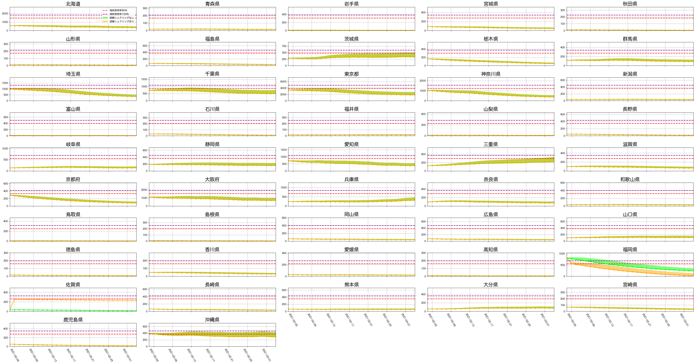

また， 主要な県で必要な医療シェリング数とその入院患者のシェアリング先は以下のようになります．

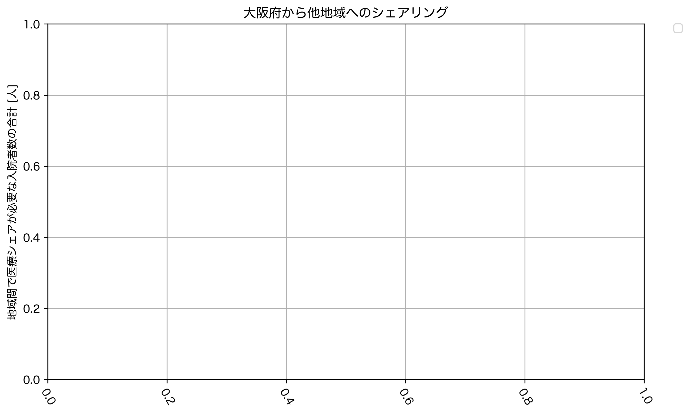

## Appendix 1 : 各県での重症者患者割合と入院者割合

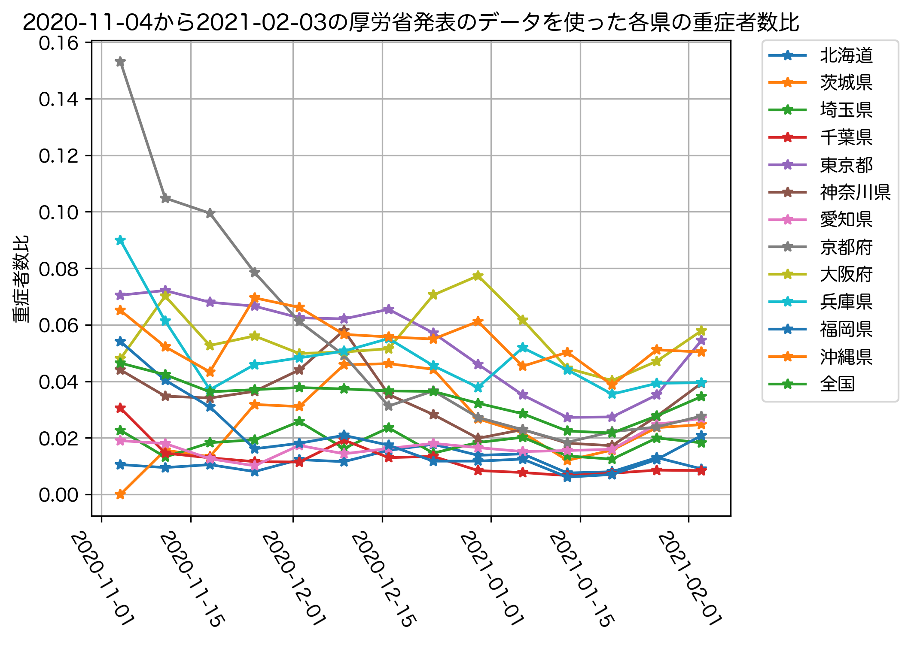

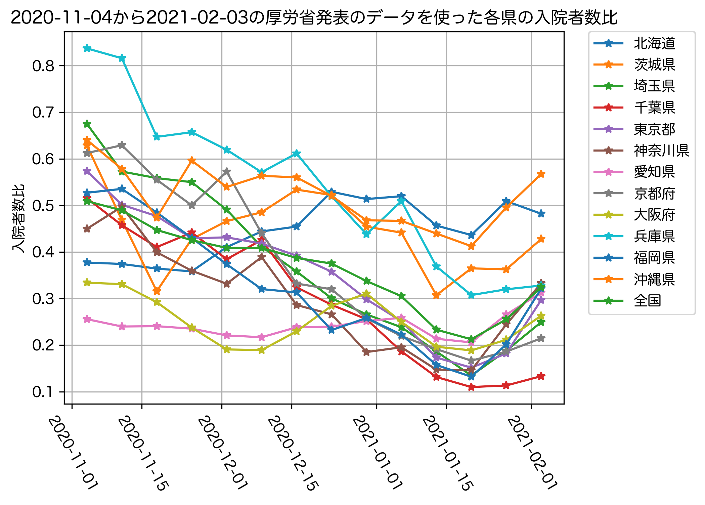

## Appendix 2: google による新型コロナウィルス患者の予測結果

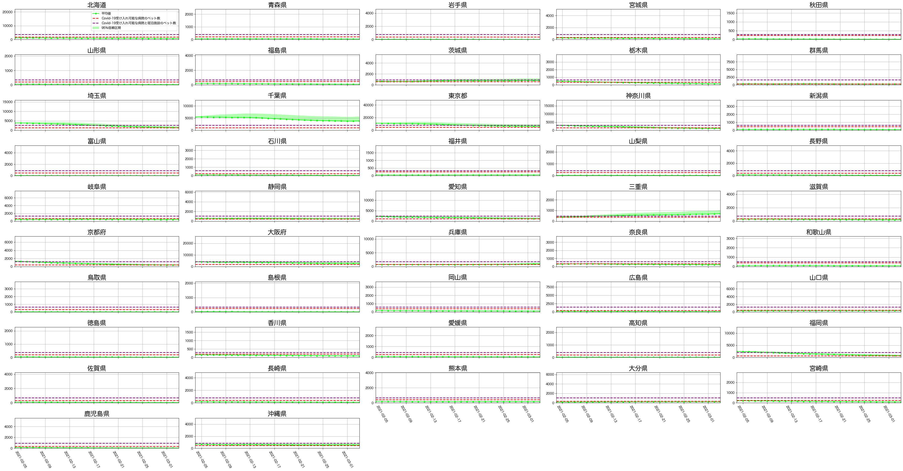

## LICENCE

Appach 2.0

## Reference

- Google の新型コロナウィルス 28 日間予測: https://storage.googleapis.com/covid-external/forecast_JAPAN_PREFECTURE_28.csv

- 厚労省, 療養状況等及び入院患者受入病床数等に関する調査について：https://www.mhlw.go.jp/stf/seisakunitsuite/newpage_00023.html

## 奥野研究室作業者向け情報
https://github.com/clinfo/2021_Patients_Transport/wiki/%E4%BD%9C%E6%A5%AD%E8%80%85%E5%90%91%E3%81%91%E6%83%85%E5%A0%B1
## 解析方法の変更履歴

**[2020-01-02]**
- 重症者数比の変化が大きい県があったため，重症者数比を直近の重症者数と患者数のみを用いるように変更．
直近の患者数が500人未満の県は全国平均を用いる．

